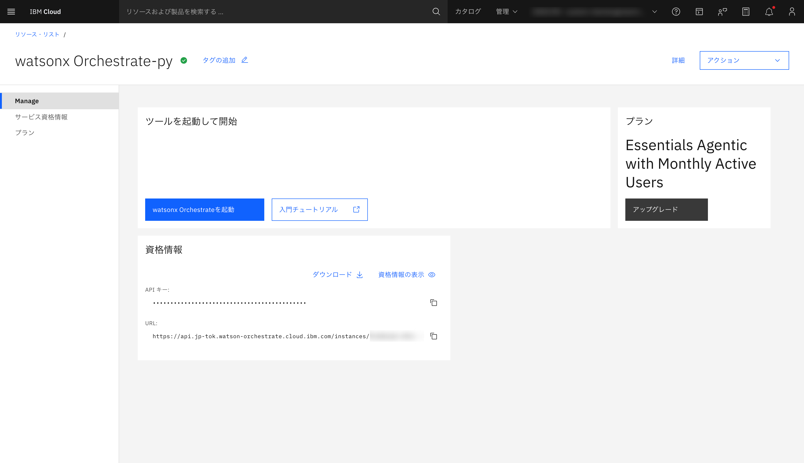
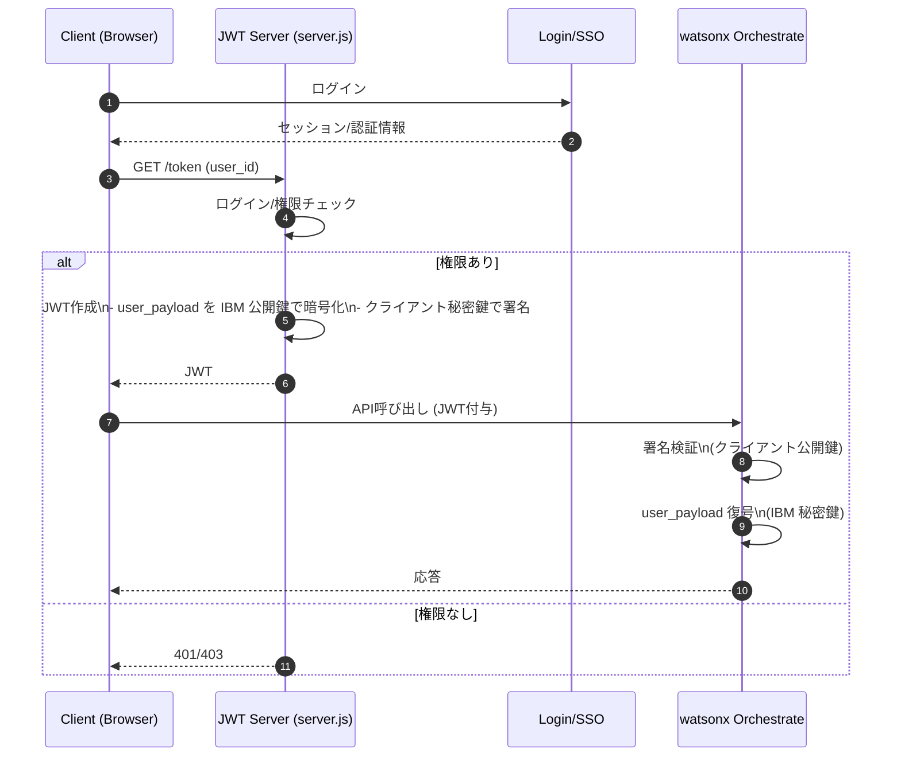
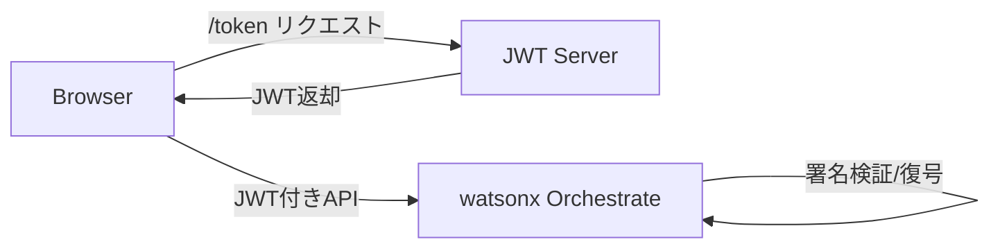

# hello-wxo-web

watsonx Orchestrate Embedded Chat を最小構成で動かすためのサンプルです。

## セキュリティ無効化（最小）

Embedded chat はデフォルトでセキュリティが有効ですが未設定のため、そのままだと動きません。
まずは匿名アクセスで動かすためにセキュリティを無効化します。

### 準備

watsonx Orchestrate の画面から`<script>`タグをコピーします。


視覚情報をダウンロードします。ここに`ORCHESTRATE_APIKEY`等のシークレットが含まれます。


### 必要な情報

- ORCHESTRATE_URL（Service instance URL）
- ORCHESTRATE_APIKEY（IBM Cloud API Key）

例（`.env` など）:

```
ORCHESTRATE_APIKEY=xxxxxxxxxxxxxxxxxxxxxxxx
ORCHESTRATE_URL=https://api.jp-tok.watson-orchestrate.cloud.ibm.com/instances/xxxxxxxx-xxxx-xxxx-xxxx-xxxxxxxxxxxx
```

### 無効化コマンド

```bash
TOKEN=$(curl -sS -X POST "https://iam.cloud.ibm.com/identity/token" \
  -H "Content-Type: application/x-www-form-urlencoded" \
  -d "grant_type=urn:ibm:params:oauth:grant-type:apikey&apikey=$ORCHESTRATE_APIKEY" | jq -r .access_token)

curl -sS -X POST \
  "$ORCHESTRATE_URL/v1/embed/secure/config" \
  -H "Authorization: Bearer $TOKEN" \
  -H "Content-Type: application/json" \
  -d '{"is_security_enabled": false}' | jq .
```

成功すると `is_security_enabled: false` が返ります。

### スクリプトで無効化する場合

`wxO-embed-chat-security-tool.sh` を使うと、対話形式で無効化できます。

```bash
ACTION=disable WXO_API_KEY=$ORCHESTRATE_APIKEY \
  FULL_INSTANCE_API_URL=$ORCHESTRATE_URL \
  ./wxO-embed-chat-security-tool.sh
```

### ファイル

- `index.html`: セキュリティ無効化の最小ページ。`config.js` を読み込み、JWT なしでチャットを起動
- `config.js`: `orchestrationID`/`crn`/`agentId` などの設定値を分離

### 使い方（最小）

1. `index.html` をブラウザで開く
2. チャットが表示されれば OK

### index.html のコア（抜粋）

`config.js` を読み込み、JWT なしでチャットを起動します。

```html
<!doctype html>
<html lang="ja">
  <head>
    <meta charset="utf-8" />
    <meta name="viewport" content="width=device-width, initial-scale=1" />
    <title>社内ポータル</title>
    <script src="./config.js"></script>
  </head>
  <body>
    <div id="root"></div>
    <script>
      window.wxOConfiguration = {
        ...window.wxoPortalConfig,
        showLauncher: true,
        layout: { form: "float", width: "380px", height: "560px" },
      };
      const script = document.createElement("script");
      script.src = `${window.wxOConfiguration.hostURL}/wxochat/wxoLoader.js?embed=true`;
      script.addEventListener("load", () => wxoLoader.init());
      document.head.appendChild(script);
    </script>
  </body>
</html>
```

## セキュリティ有効化

セキュリティを有効化することで、特定のユーザーにのみ利用してもらうことが可能です。
特定のユーザーに JWT を発行するためにサーバーが必要となります。

### 準備

1. クライアント鍵（RSA）を生成
   - `keys/example-jwtRS256.key`（秘密鍵）
   - `keys/example-jwtRS256.key.pub`（公開鍵）
2. IBM 公開鍵を API で生成して取得
   - `POST /v1/embed/secure/generate-key-pair`
3. 取得した鍵を使って設定を更新
   - `POST /v1/embed/secure/config` に `public_key`, `client_public_key`, `is_security_enabled: true`
4. JWT 発行サーバーを起動し、`authTokenNeeded` でトークンを供給

補足:

- 鍵は `keys/` に保存（`.gitignore` 済み）
- JWT は `server.js` で発行し、`index.html` が `http://localhost:3003/token` を呼びます

### 使った環境変数とスクリプト（IBM Cloud）

環境変数（例）:

```
ORCHESTRATE_APIKEY=xxxxxxxxxxxxxxxxxxxxxxxx
ORCHESTRATE_URL=https://api.jp-tok.watson-orchestrate.cloud.ibm.com/instances/xxxxxxxx-xxxx-xxxx-xxxx-xxxxxxxxxxxx
```

実行スクリプト（概要）:

```bash
mkdir -p keys
openssl genrsa -out keys/example-jwtRS256.key 4096
openssl rsa -in keys/example-jwtRS256.key -pubout -out keys/example-jwtRS256.key.pub

TOKEN=$(curl -sS -X POST "https://iam.cloud.ibm.com/identity/token" \
  -H "Content-Type: application/x-www-form-urlencoded" \
  -d "grant_type=urn:ibm:params:oauth:grant-type:apikey&apikey=$ORCHESTRATE_APIKEY" | jq -r .access_token)

IBM_PUBLIC_KEY=$(curl -sS -X POST \
  "$ORCHESTRATE_URL/v1/embed/secure/generate-key-pair" \
  -H "Authorization: Bearer $TOKEN" | jq -r .public_key)
printf "%s" "$IBM_PUBLIC_KEY" > keys/ibmPublic.key.pub

CLIENT_PUBLIC_KEY=$(cat keys/example-jwtRS256.key.pub)

curl -sS -X POST \
  "$ORCHESTRATE_URL/v1/embed/secure/config" \
  -H "Authorization: Bearer $TOKEN" \
  -H "Content-Type: application/json" \
  -d "{\"public_key\": $(jq -Rs . < keys/ibmPublic.key.pub), \"client_public_key\": $(jq -Rs . < keys/example-jwtRS256.key.pub), \"is_security_enabled\": true}" | jq .
```

### JWT 発行サーバー（セキュリティ有効時）

セキュリティを有効化した場合、`authTokenNeeded` で JWT を供給する必要があります。
このリポジトリには最小の JWT 発行サーバー `server.js` を用意しています。

### 前提

- `keys/example-jwtRS256.key`（クライアント秘密鍵）
- `keys/ibmPublic.key.pub`（IBM 公開鍵）

### コード

- `index_secure.html`: セキュリティ有効化向け。`/token` から JWT を取得し、`authTokenNeeded` で更新
- `server.js`: JWT 発行サーバー。クライアント秘密鍵で署名し、IBM 公開鍵で `user_payload` を暗号化
- `config.js`: `orchestrationID`/`crn`/`agentId` などの設定値を分離

#### index_secure.html（抜粋）

JWT を取得して `authTokenNeeded` で差し込みます。

```html
<!doctype html>
<html lang="ja">
  <head>
    <meta charset="utf-8" />
    <meta name="viewport" content="width=device-width, initial-scale=1" />
    <title>社内ポータル</title>
    <script src="./config.js"></script>
  </head>
  <body>
    <div id="root"></div>
    <script>
      const TOKEN_ENDPOINT = "http://localhost:3003/token";
      async function fetchAuthToken() {
        const res = await fetch(`${TOKEN_ENDPOINT}?user_id=anon`);
        return res.text();
      }
      function attachAuthHandlers(instance) {
        instance.on("authTokenNeeded", async (event) => {
          event.authToken = await fetchAuthToken();
        });
      }
      window.wxOConfiguration = { ...window.wxoPortalConfig };
      window.wxOConfiguration.onChatLoad = attachAuthHandlers;
      window.wxOConfiguration.token = await fetchAuthToken();
    </script>
  </body>
</html>
```

#### server.js（抜粋）

```js
const encrypted = crypto.publicEncrypt(
  {
    key: IBM_PUBLIC_KEY,
    padding: crypto.constants.RSA_PKCS1_OAEP_PADDING,
    oaepHash: "sha256",
  },
  Buffer.from(JSON.stringify(userPayload), "utf8")
);

const tokenPayload = {
  sub: userId,
  user_payload: encrypted.toString("base64"),
};
const token = jwt.sign(tokenPayload, PRIVATE_KEY, {
  algorithm: "RS256",
  expiresIn: "1h",
});
```

### 起動

```bash
npm install
npm start
```

デフォルトで `http://localhost:3003/token` からトークンを返します。

## セキュリティ有効化時の認証・認可の流れ

Embedded Chat の通信は JWT を使って認証されます。
クライアント（ブラウザ）は JWT を直接発行せず、**サーバーで発行した JWT を受け取って** wxo に渡します。

ポイント:

- JWT は **クライアント秘密鍵** で署名（RS256）
- JWT 内の `user_payload` は **IBM 公開鍵** で暗号化
- wxo は **クライアント公開鍵** で署名検証し、**IBM 秘密鍵** で `user_payload` を復号

### シーケンス図



### ブロック図（簡易）



### 認証・認可の補足

- **認証**: JWT の署名検証により「このクライアントが正当か」を判定
  （JWT サーバーが発行したトークンであることを wxo が検証）
- **認可**: JWT 内の `sub`（ユーザー ID）や `user_payload` を元に、wxo 側でユーザー文脈を使って処理

## ログインユーザーのみに限定する場合

Embedded Chat を「ログインしたユーザーだけ使える」ようにするには、**JWT を発行するサーバー側でアクセス制御**を行います。

流れ:

1. 既存のログイン機能でユーザーを認証
2. JWT 発行エンドポイントで「ログイン済み＆権限あり」をチェック
3. 条件を満たすユーザーにだけ JWT を発行（満たさない場合は 401/403 を返す）

これにより、ブラウザ側から直接チャット API を呼べても、**JWT を取得できないユーザーは利用できません**。

## 注意

セキュリティ無効化は匿名アクセスになります。公開サイトで使う場合は、権限や公開範囲に注意してください。
